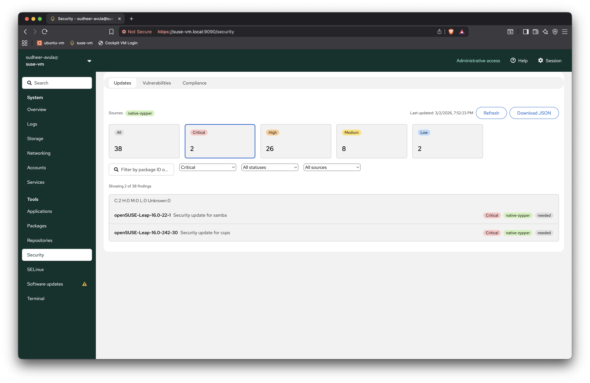
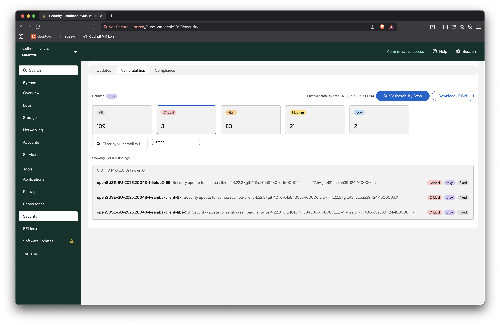
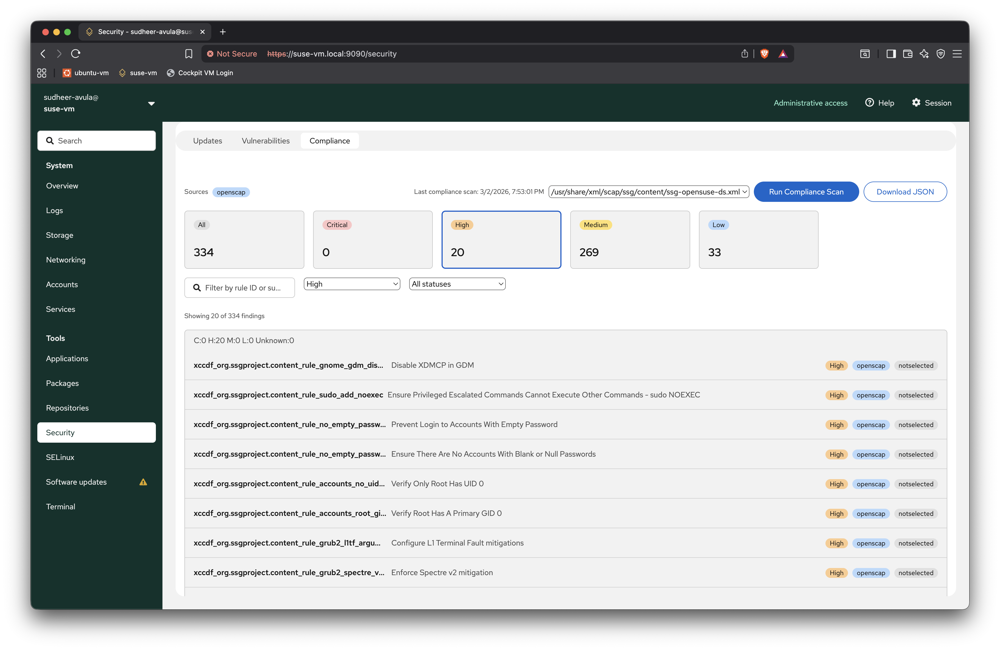

# Cockpit Security

Cockpit Security is a Cockpit plugin that provides host security visibility across three tabs:

- `Updates`: pending security updates from native package manager providers
- `Vulnerabilities`: on-demand vulnerability scan results (Trivy)
- `Compliance`: OpenSCAP compliance results

It follows Cockpit UI conventions and keeps scan execution logic separate from UI components.

## Runtime Requirements

- Cockpit server/runtime
- For `Updates` tab:
  - openSUSE: `zypper`
  - Ubuntu/Debian: `apt`
- For `Vulnerabilities` tab:
  - `trivy` installed on host
- For `Compliance` tab:
  - openSUSE: `openscap-utils`, `scap-security-guide`
  - Ubuntu/Debian: `openscap-scanner`, `ssg-base`

## Install (openSUSE)

```bash
sudo zypper install -y cockpit cockpit-bridge nodejs npm make gettext-runtime
sudo zypper install -y openscap-utils scap-security-guide
# optional for Vulnerabilities tab
sudo zypper install -y trivy
```

Build and install plugin:

```bash
git clone https://github.com/cockpit-project/security.git
cd security
make
sudo make install
```

## Install (Ubuntu)

```bash
sudo apt update
sudo apt install -y cockpit nodejs npm make gettext
sudo apt install -y openscap-scanner ssg-base
# optional for Vulnerabilities tab
# install trivy from your preferred repository
```

Build and install plugin:

```bash
git clone https://github.com/cockpit-project/security.git
cd security
make
sudo make install
```

## Development

Use a development symlink:

```bash
make devel-install
```

Watch mode:

```bash
make watch
```

Code quality checks:

```bash
npm run eslint
npm run stylelint
```

## Normalized Dataset Collector (Research)

This keeps the existing tab architecture unchanged:

- `Updates` tab exports patch report JSON
- `Vulnerabilities` tab exports Trivy report JSON
- `Compliance` tab exports OpenSCAP report JSON

Then run a separate collector CLI to merge those independent reports with host metadata into one stable normalized record.

Each exported tab report now includes a common `metadata` object with host/system fields and scan metadata, so consolidation can be done offline from JSON files without re-reading host state.

Common metadata fields embedded in each report:

- `scan_timestamp`
- `host_id`, `distro`, `distro_version`, `kernel_version`
- `environment_type`, `host_role`, `package_manager`
- `cpu_count`, `memory_gb`, `installed_package_count`, `running_service_count`
- `scan_seconds`
- `scanner_version`
- `scanner_dataset_version`

Normalized output also includes `compliance_profile`, indicating which OpenSCAP report/profile was used for compliance normalization.

### Collector Workflow

1. Generate/download per-source reports from tabs.
2. Place them in one host directory (or pass explicit paths).
3. Run collector CLI.
4. Use the generated `normalized-host-security-record.json` as one dataset row.

### Run Collector (host-dir mode)

Expected filename candidates in `--host-dir`:

- patch: `patch-report.json` or `vulnerabilities-native-zypper.json` or `vulnerabilities-native-apt.json`
- Trivy: `trivy-report.json` or `vulnerabilities-trivy.json`
- OpenSCAP: `openscap-report.json` or any `vulnerabilities-openscap*.json`

```bash
npm run collect:normalized -- --host-dir /path/to/host-dir
```

If the host directory contains multiple OpenSCAP reports, collector automatically generates one normalized record per OpenSCAP report and writes an array output.

Use `--openscap-profile` only to filter to specific profile(s):

```bash
npm run collect:normalized -- \
  --host-dir /path/to/host-dir \
  --openscap-profile ssg-sle16-ds \
  --out /path/to/normalized-host-security-record.json
```

Use `--openscap` only when you want a single explicit OpenSCAP file:

```bash
npm run collect:normalized -- \
  --host-dir /path/to/host-dir \
  --openscap /path/to/host-dir/vulnerabilities-openscap-ssg-sle16-ds.json \
  --out /path/to/normalized-host-security-record.json
```

Default output path:

- single OpenSCAP input: `/path/to/host-dir/normalized-host-security-record.json`
- multiple OpenSCAP inputs: `/path/to/host-dir/normalized-host-security-records.json`

### Run Collector (explicit paths)

```bash
node tools/collect-normalized-host-record.mjs \
  --patch /path/to/patch-report.json \
  --trivy /path/to/trivy-report.json \
  --openscap /path/to/openscap-report.json \
  --out /path/to/normalized-host-security-record.json
```

### Optional Metadata Input

Use `--metadata` only when you want to override or supplement report metadata:

```json
{
  "patch_scan_seconds": 1.4,
  "vuln_scan_seconds": 18.7,
  "compliance_scan_seconds": 72.3,
  "scanner_trivy_version": "0.49.0",
  "scanner_openscap_version": "1.4.1",
  "scanner_dataset_version": "unknown",
  "environment_type": "unknown",
  "host_role": "unknown"
}
```

If a value is unavailable, collector keeps schema-complete output with defaults:

- string fields: `"unknown"`
- numeric fields: `0`

## Screenshots

### Updates Tab



### Vulnerabilities Tab



### Compliance Tab



## Additional Documents

- [SECURITY_MODEL.md](SECURITY_MODEL.md)
- [THIRD_PARTY_NOTICES.md](THIRD_PARTY_NOTICES.md)
